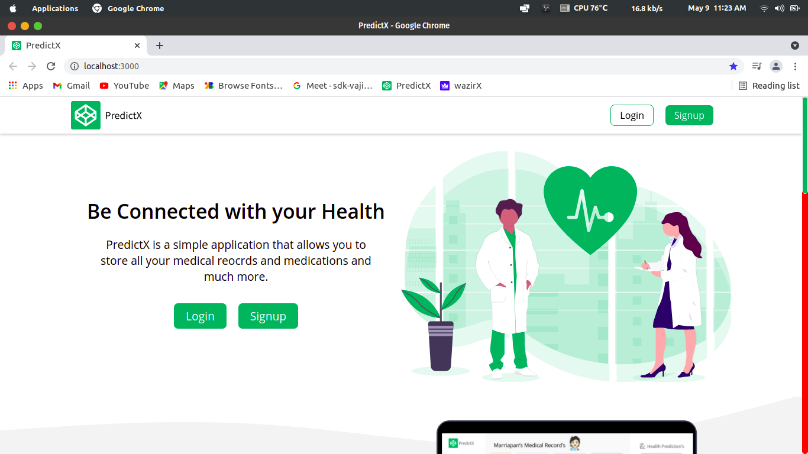
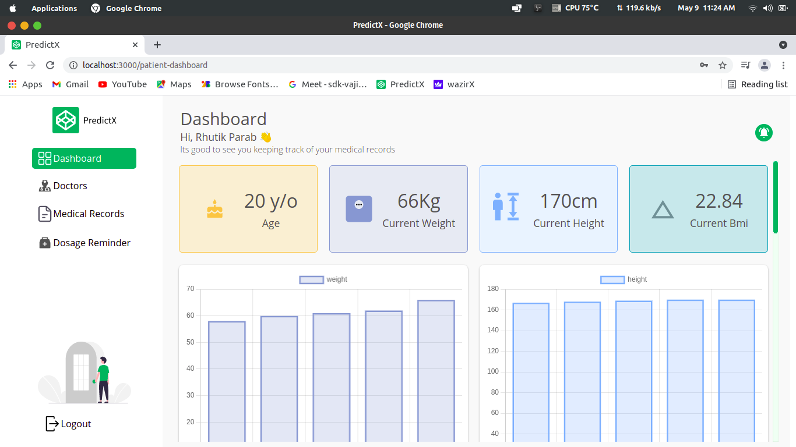
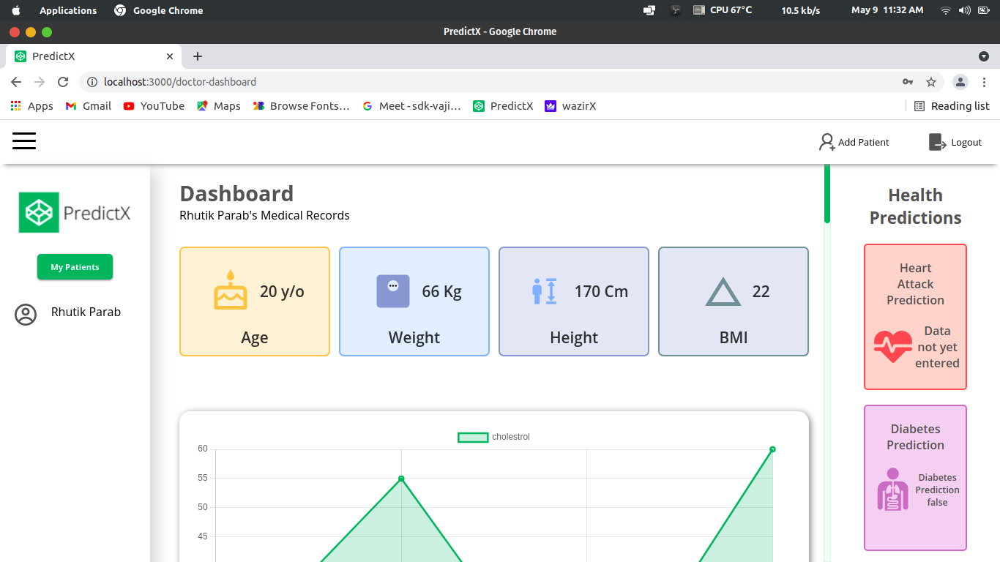

# Team PredictX
A simple platform that allows you to store all your medical reocrds and medications, can accurately predict the risk of heart attack and diabetes and much more.

## Team Members
1. Sanket Marathe
2. Sairaj Kapdi
3. Rhutik Parab

## Project Description

One platform for doctors and patients to connect, manage and make accurate health predictions.

#### Keep track of your patients health
Transform your clinic or hospital into digital environment for better care for patients through a standalone health record management and follow-up visit reminders on patient’s digital health wallet along with patient relationship.
#### Detect heart desease and diabeties with powerful AI
The digital self-care app that helps you predict the risk of any heart & diabetes related diseases.
#### Medication Reminder for Patient 
Manage Health details to access anytime, anywhere and trend health progress. Make yourself aware and understand of how to maintain personal Health.

## Getting Started

#### 1. Clone the Repository
#### 2. [Install Node.js](https://nodejs.org/en/download/package-manager/)
#### 3. Install the required dependencies
```
npm install
```
Run this command in main (/) and /backend directory
#### 4. Fireup the Backend server
```
nodemon server.js
```
Run this command in /backend directory
#### 5. Fireup the Frontend server
```
npm start
```
Run this command in main (/) directory

## Live Demo
#### [Click here](https://predictx.herokuapp.com/)

## Some Screenshots
## Home Page
  
 
  
## Patients Dashboard

  
## Doctors Dashboard
 
